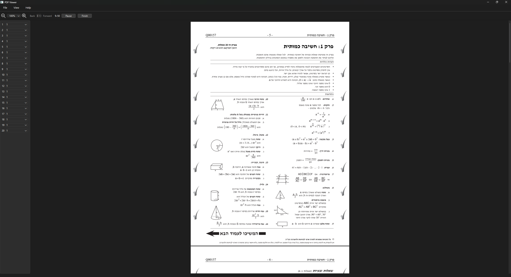
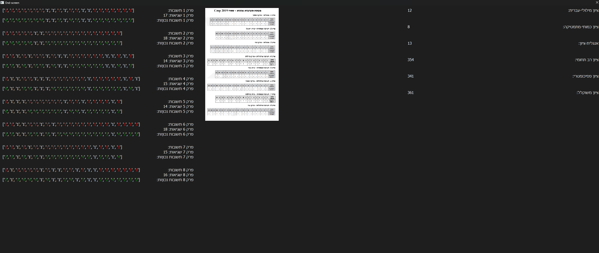

# DigitalPsychometric

A small tool for digitizing printed psychometric exams and running exam simulations with a simple GUI.

This project helps convert exam PDFs and their answer keys into an interactive simulation environment. It's lightweight and intended to run locally with a minimal setup.

<!-- Replace the full-size markdown image with a smaller display that links to the original -->
<p align="center">
  <a href="img.png" target="_blank">
    
  </a>
</p>

---

## Quick overview

- Purpose: run simulated psychometric exams from scanned or pre-made exam PDFs and manage saves/answers.
- GUI: built with PySide6.
- PDF handling: uses PyMuPDF (fitz).

---

## Features

- Load exams from the `Exams/` or `FullExams/` folders.
- Save and resume exam sessions via the `Saves/` folder.
- Grade answers using extracted grading keys.
- Bundle the app into a single executable using Nuitka (optional).

---

## Requirements

- Python 3.8+ (3.12 is known to work in the author's environment)
- PySide6
- PyMuPDF (imported as `fitz`)
- (Optional) Nuitka to build a standalone executable

Suggested pip install:

```bash
pip install pyside6 pymupdf
```

If you prefer conda (author used conda):

```bash
conda create -n OnlinePsychometric python=3.12
conda activate OnlinePsychometric
pip install pyside6 pymupdf
```

---

## Quick start

From the project root, run:

```bash
python start.py
```

This opens the GUI. Use the interface to start a new exam or load a save from `Saves/`.

You can also run the compiled `DigitalPsychometric.exe` if you built the project with Nuitka.

Note: The compiled executable is not included in this repository due to file size limits. Please build it locally using the instructions below.

---

## Build (optional — Windows example)

To create a single-file executable using Nuitka (example for Windows/cmd.exe). Run this command from the project root directory.

Example (single-line command):

```bash
python -m nuitka --follow-imports --standalone --disable-console --onefile --enable-plugin=pyside6 --include-data-dir="Saves=Saves" --include-data-dir="Exams=Exams" --include-data-dir="FullExams=FullExams" --output-filename=DigitalPsychometric start.py
Notes:
- `--include-data-dir="SOURCE=TARGET"` maps a folder from disk into the bundled app. The `SOURCE` must exist when you run Nuitka, otherwise you'll get a `malformed '--include-data-dir'` error.
- This assumes you are running the command from the project root where `Saves/` exists.

---

## Project layout (important files)

- `start.py` — application entry point; initializes the GUI and launches `main.py`.
- `main.py` — main exam flow and UI coordination (runs per chapter and calls `end.py`).
- `end.py` — shows the final stats and grading summary after the exam.
- `pdfbackend.py` — PDF handling and save/load logic.
- `Exampreprocessing.py` — preprocessing utilities to extract and organize PDF data into exam folders.
- `ui_mainwindow.py`, `mainwindow.py`, `zoomselector.py` — PySide GUI files and helpers.

There are example folders under `Exams/`, `FullExams/`, and a `Saves/` folder with sample save slots.

---

## Todo / Roadmap

- Manual checks (post-release)
- Essay grader (future)
- Refactor and publish (clean-up and packaging)

(Completed items are already in the repo history.)

---

<!-- Replace the bottom markdown image with a smaller display as well -->
<p align="center">
  <a href="img_1.png" target="_blank">
    
  </a>
</p>

---

Written by the project author (with some help from automation).
